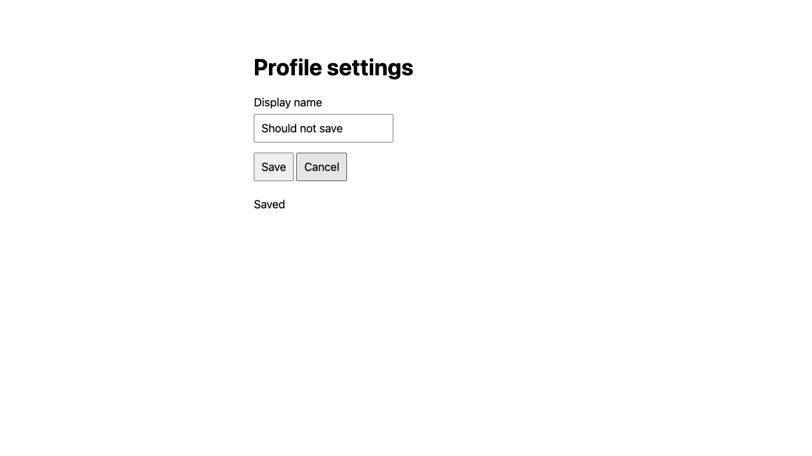

# Validation — September 12, 2026

## Scope and limitations

Both skills passed the skill-creator `quick_validate.py` checks for frontmatter, naming, and unfinished scaffolding. Their local Markdown references and Codex display metadata were also checked.

The author additionally exercised the proposed workflows against a small, self-authored localhost fixture with two deliberately seeded defects. This is a supervised smoke test of the workflow and evidence requirements, **not an independent agent evaluation or a measure of bug-finding effectiveness**. No workshop application or external service was tested or changed.

The reproducible fixture is in [validation-fixture/server.py](validation-fixture/server.py), with [explicit requirements](validation-fixture/requirements.md). It uses only Python's standard library, listens on loopback at an ephemeral port, prints that port on startup, and stores disposable data in memory. Its `X-Test-User` header is a deliberately simple fixture identity mechanism, not production authentication. The fixture is intentionally insecure; do not deploy it.

Run it locally with `python3 docs/validation-fixture/server.py`, use the printed port for requests/browser navigation, and stop the process after the session. Restarting it resets all data. No test server or browser session is left running from this validation.

## Initial risk assessment

| Area | Source evidence / hypothesis | Impact and priority | Runtime experiment |
| --- | --- | --- | --- |
| Order access | Route recognizes a test identity but returns the selected order without comparing its owner | Potential cross-user disclosure; first API priority | Compare anonymous, owner, and other-user reads |
| Profile Cancel | Cancel is inside a form without an explicit button type; its click handler does not cancel form submission | Unwanted persisted edit; first UI priority | Compare empty versus valid data, Save versus Cancel, and backend state |

The source findings were hypotheses for live confirmation. The fixture requirements, rather than its faulty implementation, established the expected outcomes. Source and runtime matched because the inspected fixture was launched directly for this session.

## API smoke test

Tool: curl against the temporary loopback server, with five-second request timeouts. Anonymous and owner contrasts plus the cross-user probe exercised identity handling; no data was modified by these requests.

| Request | Expected | Observed |
| --- | --- | --- |
| Anonymous `GET /api/orders/1` | Reject unauthenticated access | 401, `Authentication required` |
| Alice `GET /api/orders/1` | Return Alice's order | 200, owner `alice` |
| Bob `GET /api/orders/2` | Return Bob's order | 200, owner `bob` |
| Alice `GET /api/orders/2` | Deny access to Bob's order | 200, owner `bob`, item `Pen`; reproduced 2/2 |

The seeded ownership defect was confirmed at runtime: a recognized identity can retrieve another user's order. The consequence is disclosure across the fixture's user boundary. This supports a High impact classification for the demonstrated access-control behavior, while saying nothing about production exploitability or data sensitivity outside this toy system. A useful regression should prove allowed owner access and denied cross-user access through the actual HTTP route.

## UI smoke test

Tool: Playwright CLI 0.1.19, dedicated `exploratory-skills-smoke` session, headless Chromium 152 on macOS, viewport 1280 × 720 CSS pixels. This was a focused functional reproduction, not a responsive or accessibility assessment.

| Action and state | Network observation | Follow-up HTTP state |
| --- | --- | --- |
| Cancel with empty required name | No profile POST in the before/after request records during this action | `Original`, save count 0 |
| Save with `Saved baseline` | Request 2: `POST /api/profile`, 200 | `Saved baseline`, save count 1 |
| Cancel with `Should not save` | Request 3: `POST /api/profile`, 200 | `Should not save`, save count 2 |
| Cancel with `Second unsaved edit` | Request 4: `POST /api/profile`, 200 | `Second unsaved edit`, save count 3 |

The seeded Cancel defect was confirmed in 2/2 valid-input attempts. DOM inspection showed the button's effective type was `submit`. The empty-input contrast demonstrated why testing only an invalid form could miss the unwanted save. Successful network responses and subsequent HTTP reads established persistence; the screenshot alone would not have established it.

The screenshot below was captured and opened. It shows the edited value and `Saved` feedback after clicking Cancel. The form controls and feedback are visible at the sampled viewport; no broader visual-quality claim is made.

The demonstrated impact is an unwanted profile edit despite selecting Cancel; a subsequent explicit save can restore the value. This supports Medium severity for the fixture's behavior. A regression should verify that Cancel with valid changed data sends no save request and preserves the original persisted value, while Save still works.

Console review found a favicon 404. It was separated from the functional finding; no evidence connected it to the unwanted mutation. The browser session was closed and the fixture process stopped, discarding its in-memory data. No network mocks or persistent credentials were created.

## Decision review beyond the smoke test

The skill instructions were manually reviewed against these routing cases:

- A user supplies code and a URL: reuse them, inspect relevant code/tests, prioritize risks, then perform live probes.
- A user cannot share code: continue black-box testing and state the limitation.
- Runtime is unavailable: produce code-evidenced findings and reproduction proposals, leaving execution/visual verification explicitly pending.
- Playwright CLI is unavailable: use an available browser agent; identify missing network/image capabilities without claiming those observations.
- A local branch differs from an unknown deployment: separate code hypotheses from runtime evidence.
- A UI/API action would affect unrelated users or create real external effects: reuse existing authorization where it applies; clarify only the missing boundary and continue independent work.

These are instruction reviews, not independently executed model trials. Real-project evaluation, alternate browser-agent execution, intermittent network behavior, responsive testing, screen-reader testing, and production-scale risk prioritization remain untested by this smoke test.

## Expertise and skill-design refinement

The follow-up revision adds experiment-selection references and shortens the UI entrypoint by moving detailed browser evidence guidance into its live-exploration reference. Both entrypoints now bound the initial source-reading pass and explicitly preserve the first failure before minimizing it. Existing tool preferences, partial-access modes, evidence requirements, and authorization boundaries are retained.

The added guidance was manually walked through against these decision cases:

| Situation | Decision supported by the revised guidance |
| --- | --- |
| A mutation times out after submission | Investigate whether it took effect before deciding to replay it |
| An API returns 202 with a pending operation | Observe the documented completion mechanism within bounds; do not label acceptance as completion |
| Code, comments, and tests agree on an outcome that conflicts with requirements | Investigate the conflict; do not count their agreement as independent evidence of correctness |
| A forced click triggers behavior unavailable through normal controls | Label the diagnostic intervention and establish ordinary-user reachability before making that claim |
| A failing sequence passes only after reusing changed test data | Preserve the first evidence and compare fresh-state reproduction instead of treating the retry as a clean pass |

HTTP retry/idempotency and acceptance guidance was checked against the linked RFC 9110 sections; workflow guidance links to OWASP WSTG. These additions have not been independently tested with another agent. The original live smoke evidence remains valid for the unchanged fixture and should not be read as validation of the new asynchronous or concurrency techniques.

## Practical benchmark follow-up — September 12, 2026

The [usability extension](../evals/results/2026-09-12-usability.md) added explicit passing/blocked/missing-source outcomes and course-derived validation cases. Observed failures led to two narrow skill changes: stop unavailable-service probe batches, and explain what relevant source could add to a completed runtime-only assessment. Fresh targeted reruns met those outcomes; initial failures remain preserved. These development cases are not held-out effectiveness evidence.

## Portable installation and benchmark scope — September 12, 2026

Removed optional per-skill `agents/openai.yaml` display metadata; the portable skill entrypoints and references are unchanged. Earlier metadata checks and archived skill hashes describe their original snapshots. Both remaining skill directories pass `quick_validate.py`.

The dependency-free Node installer supports Claude Code, Codex, Cursor and Copilot, project or personal destinations, single-skill selection, dry runs, unchanged-copy detection, and explicit replacement with backups outside discovery directories. Ten automated tests pass, including file integrity, conflict prevention, symlink refusal, rollback, and execution through an npm-style bin symlink. Project and personal paths are checked with temporary directories, not by altering actual user installations.

`npm pack` contains nine files: README, package metadata, installer, and six skill/reference files. It excludes eval fixtures, reports, tests and `agents/` metadata. Packed installation through `npx --yes --package=<archive> exploratory-skills --agent <client>` passed for all four client destinations. A first shorthand archive invocation failed because npm tried to execute the archive as a command; explicit package/bin selection resolves this and is used in the README. Tested runtime: Node.js 24.15.0, npm 12.0.2 on macOS; Node.js 20 is the declared minimum, not a separately tested runtime. Native discovery and behavioral equivalence across all four clients have not been independently tested.

New evaluation tasks exclude documentation-only defects in their common reporting contract. New manifests and grade output retain the scope; human review decides functional versus documentation claims. Fifteen harness tests pass, including equal scope instructions for skill/baseline, fixture/live, and API/UI preparation. Course DOC-08 remains historical evidence and receives no discovery credit under the current scope. Historical reports, scores and submissions are unchanged. No new agent-performance result is claimed for these packaging and scope edits.
