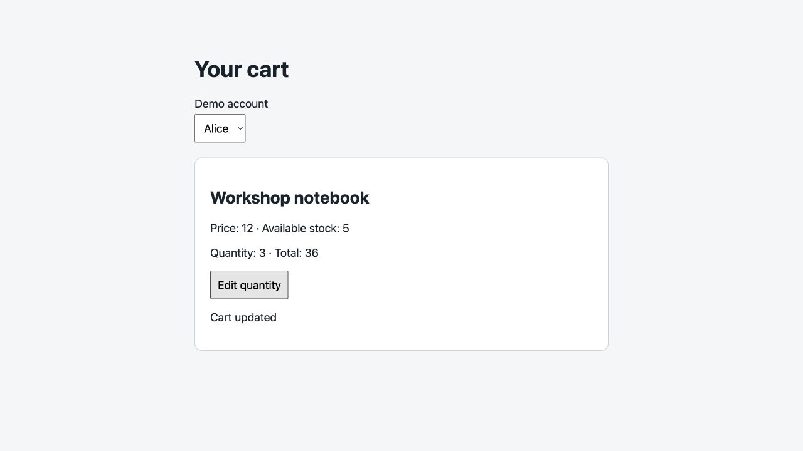
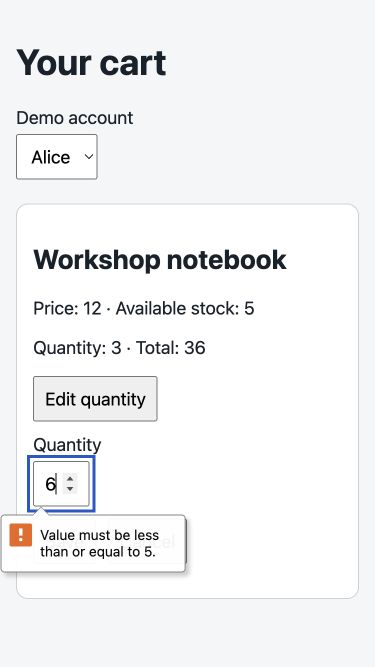
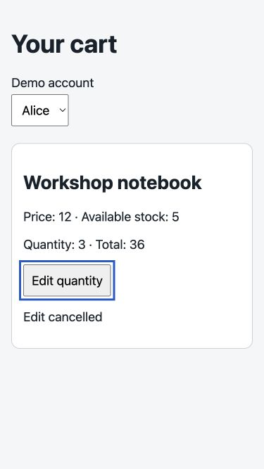
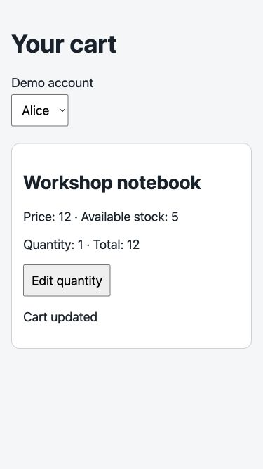

# Cart exploration report

No confirmed requirement discrepancies were found in the exercised flows. This is a bounded exploratory result, not a full correctness claim.

## Approach and coverage

Read TASK.md, requirements.md, REPORTING.md and the relevant domain, HTTP handler, UI HTML/JavaScript/CSS, and existing tests. Prioritized provisional edits and persistence, identity isolation, quantity validation, stock boundaries, visible totals, and narrow keyboard operation.

- CART-1: Alice and Bob returned their own baseline carts. Anonymous reads and updates returned 401. Updating Alice to five left Bob at two.
- CART-2: negative, fractional, missing, null, string and boolean quantities returned 400; each rejection was followed by GET confirming unchanged Alice state.
- CART-3: six returned 409 without mutation; five succeeded; catalog stock remained five.
- CART-4: totals were 12 for one, 36 for three, and 60 for five.
- UI-1: provisional input did not change summary; Cancel acknowledged cancellation, returned focus to Edit and reopening restored saved quantity. Keyboard Save changed summary and persisted quantity. Switching identity hid the open editor and showed the selected account.
- UI-2: successful saves acknowledged; invalid six displayed native validation. Desktop and 375x667 narrow screenshots were opened and visually inspected. Save and Cancel worked with keyboard from the editor. Save left focus on the page; an attempted Tab/Return did not reopen Edit, so complete sequential traversal remains unverified rather than reported as broken.

Existing two unit tests passed; they cover valid updates/isolation and stock rejection only. Output: [tests](evidence/tests.txt). Runtime requests and responses: [HTTP evidence](evidence/http.json). Detailed browser sequence: [UI notes](evidence/ui-notes.txt).

## Visual evidence

## Remaining risks

Medium: stale responses during account switching and overlapping Save/Cancel requests. Source has no response identity guard or pending-save lock. This was not reproduced with controlled latency.

Medium: network failure recovery. Async UI handlers have no catch; offline and server errors were not induced.

Low: catalog price changes. Domain total uses literal 12, which agrees with this fixture; future price changes need coverage. No current-price discrepancy was observed.

## Limits and accounting

25 direct API requests were recorded. UI source and executed actions account for seven additional expected API requests (initial GET, two saves each with PUT+GET, two identity changes), giving 32 total expected API requests; UI traffic was not independently instrumented. 27 browser interactions including opening/closing the tab and viewport set/reset; observation calls excluded. Four screenshots saved and inspected. 14 orchestration/browser tool invocations including final report generation. Elapsed wall time was not independently timed; no exact duration, token usage or cost is claimed.

Zero removal was source-reviewed but not executed on runtime to preserve the fixtures: adding removed items is explicitly unsupported. No latency injection, concurrency, offline, or screen-reader testing. Cancel's lack of update request is code-supported and consistent with visible behavior, not demonstrated by a browser network capture.

## Cleanup

Final API GETs verified Alice quantity 1 / total 12 and Bob quantity 2 / total 24. Viewport override reset and only the created browser tab closed. No application, requirement, or existing test files changed. The process remains running for its owner to stop.
