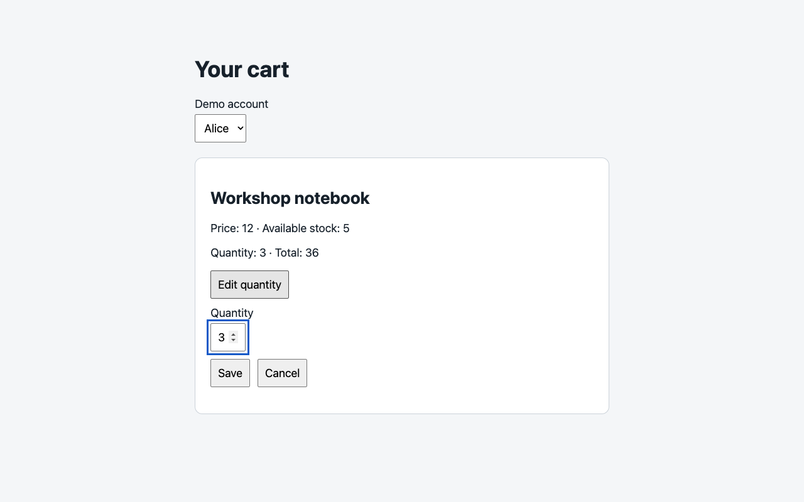
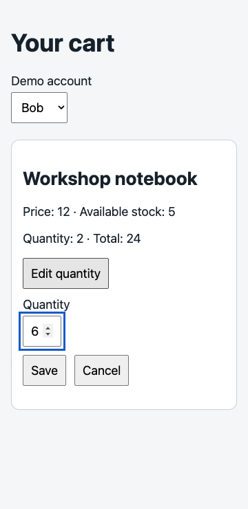
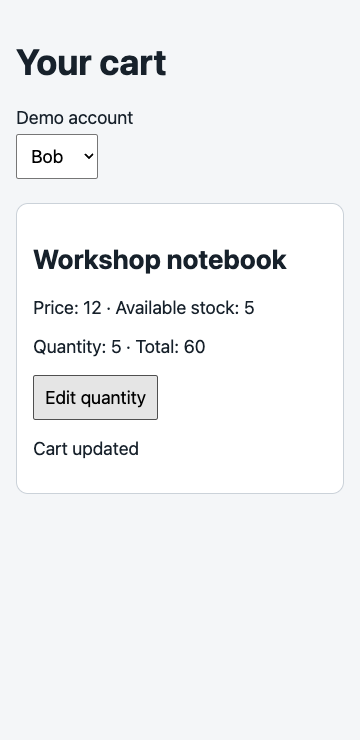

# Cart editor exploration

No confirmed discrepancy was found in the exercised scope. This is a bounded exploratory result, not exhaustive certification.

## Charter and environment

Explore existing-item editing, visible totals, explicit Save/Cancel, persistence, and nearby identity/validation risks against CART-1–4 and UI-1–2. Checkout, adding removed items, and production authentication are excluded. Limits: five minutes, 60 API requests, 45 browser actions.

Session: 2026-09-12, approximately 08:35:55–08:39:51 UTC (approximately four minutes). Runtime: http://127.0.0.1:64182. Chromium 152.0.7977.84 via installed Playwright CLI; dedicated session `cart08`. Desktop 1280×800 and narrow 360×740 CSS pixels, no intentional throttling or device emulation. Alice and Bob disposable fixtures only.

Source: inspected `app/static/app.js`, `index.html`, `style.css`, `app/domain.py`, `app/app.py`, and `app/test_domain.py`. No revision identifier supplied; no parent repository inspected. Runtime `/health` reports `sample-1`. Served JS, HTML and CSS matched inspected files exactly, with SHA-256 fingerprints in [HTTP evidence](evidence/http.json). Backend revision equivalence remains unknown.

## Results and evidence

- **Save / totals:** Alice changed from 1 / 12 to 3 / 36 using Edit, input and Save. Reload still showed 3 / 36. Browser requests recorded one PUT and refresh GET for that save. A later independent API read confirmed quantity 3 and total 36.
- **Cancel:** Alice edited 3 to 4 and clicked Cancel; reopening showed saved 3. Bob later edited saved 5 to 4, tabbed to Cancel and activated it with Enter, reopened using keyboard, attempted invalid 6, and cancelled again. No additional PUT appeared during those cancel/invalid sequences. A fresh API read confirmed Bob remained 5 / 60. The recorded request list contains exactly two browser PUTs overall, corresponding to the two valid Save actions.
- **Narrow keyboard Save:** Bob began at 2 / 24, demonstrating Alice's earlier save had not changed Bob's cart. Submitting 6 did not mutate the cart; changing to 5 and pressing Tab then Enter saved 5 / 60 with visible “Cart updated.”
- **API constraints:** Alice's negative, fractional, missing, null, string and boolean quantities each returned 400; quantity 6 returned 409. A separate GET after each confirmed Alice remained 3 / 36. Anonymous cart GET returned 401. Product stock remained 5 after valid saves.
- **Visual sampling:** all three linked screenshots were opened and inspected. Desktop reopened editor has visible saved value 3 and total 36. At 360px the editor, Save and Cancel fit visibly; successful feedback and total 60 are readable. The invalid screenshot preserves the editable 6 and saved total 24; it does not capture a native validation bubble, so visible error-message presentation is not fully verified.
- **Existing tests:** inspected and executed `python3 -m unittest discover -s app -v`: two tests passed (total/other-identity preservation and stock rejection). These do not cover browser handlers, keyboard behavior, or most malformed quantities.

[Browser request list](evidence/requests.txt), [API requests, responses and cleanup](evidence/http.json), [browser sequence](evidence/explore.js), [focused keyboard sequence](evidence/verify.js), [console inspection](evidence/console.txt).

## Risk map and remaining probes

| Journey / state | Evidence and impact | Protection / uncertainty | Priority and next probe |
| --- | --- | --- | --- |
| Cancel accidentally submits | Would silently overwrite provisional edits | Explicit `type="button"`; tested valid and invalid cancel, no extra PUT; API unchanged | Explored, no defect. Regression: Cancel via mouse and keyboard must emit zero PUTs and reopening must restore saved value. |
| Save updates total / role isolation | Incorrect summaries or cross-account changes | Live saves, reload/API verification, Bob baseline and stock boundary correct; domain tests cover basic isolation | Explored, no defect. Regression: 1→3 produces 3 / 36 and leaves Bob at 2. |
| Invalid data / availability | Rejection might partially mutate cart | 400/409 and fresh preserved-state reads confirmed; HTML constraints block normal invalid Save | Explored API rejection; UI error presentation partial. Next: capture native validation bubble and server-error rendering. |
| In-flight identity switch / stale response | Async refresh writes shared `current` without request-version checks; old data could reach a newly selected account view | Not tested with delayed responses; no ordinary-session failure observed | High residual risk. Delay Alice GET, switch to Bob, then inspect summary and reopened value when responses settle. |
| Transport failure / recovery | `fetch` has no catch; failed networking could leave ambiguous feedback | No injected failures in this session | Medium residual risk. Interrupt PUT/refresh separately, inspect visible error and ability to retry, verify persisted state. |
| Zero removal | Domain deletes item; subsequent update is out of scope and cannot re-add it | Source inspected; live zero deliberately omitted to preserve restorable fixtures | Medium residual risk. With owner-resettable disposable fixture, save zero, reload, verify totals 0 and empty items. |
| Keyboard / widths | Losing focus after Save may impair repeated editing; native validation message appearance uncertain | Keyboard Save/Cancel exercised at narrow width; desktop pointer flow sampled | Medium residual risk. Fully keyboard-only entry and repeated edit loop at both widths, native validation screenshot, real assistive-technology check. |

## Evidence limits and cleanup

The first scripted response logger used unavailable `URL` and produced a tool-side ReferenceError after actions had executed. Screenshots were retained and opened. CLI network records and independent API reads supplied outcome evidence. The focused repeat completed, but its `console.log` return data was not emitted by the CLI; its saved output establishes the executed sequence, not the omitted intermediate state values. Therefore detailed focus IDs, native validation message text and per-step callback counters are not claimed as captured evidence. Browser console inspection returned zero messages; that does not erase the separate instrumentation error.

No source, requirements, skill, or existing tests were edited. No findings are invented from missing coverage. No performance, delayed-response ordering, complete accessibility, real mobile browser, or server-failure UI assessment was performed. No mocks or interceptors were installed.

API request total: **30** (8 browser API requests plus 22 direct API probes, including cleanup). Browser interaction/navigation/resize/screenshot actions: **34 including open and close**; with six additional CLI browser observation commands, **40**. In-script read-only state queries are described separately in saved scripts. No token/cost metric was available. The time above is approximate wall-clock time, not measured CPU usage.

Restored Alice to quantity 1 / total 12 and Bob to quantity 2 / total 24; GET verified both. Product stock remained 5. Closed only the dedicated `cart08` browser. Owner's server remains running. Reports, scripts and screenshots remain under this candidate directory.
