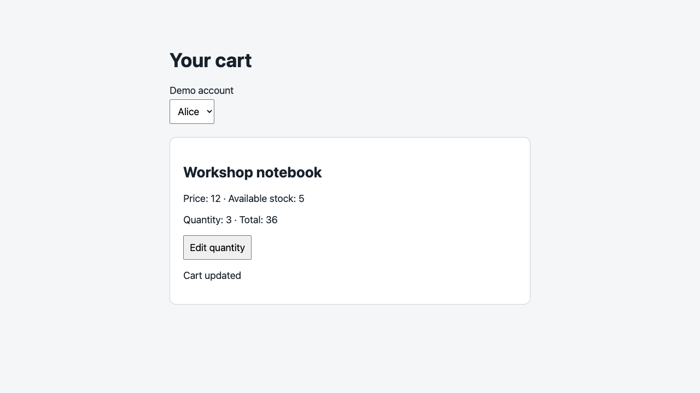

# Evaluation status — September 12, 2026

A [completed retry assessment](2026-09-12-retry.md) is now available. This document preserves the initial blocked attempt; its missing scores are not failures or completed-trial results.

The evaluation infrastructure passed its checks. **The skills have no independent evaluation score from this run.** Three fresh evaluator agents were launched with candidate-only tasks, but account usage limits stopped all three before they produced reports. The remaining cases and without-skill baselines were not launched. No skill changes were inferred from these blocked runs.

The [machine-readable record](2026-09-12.json) includes statuses and SHA-256 hashes for the skills, sample fixture, case definitions, harness, and rubric. Null scores mean unavailable; they do not mean zero or a pass.

## Verified infrastructure

| Check | Result |
| --- | --- |
| Harness tests | 8 passed: mutation behavior, fail-closed mutation anchors, evidence-path containment, no overwrites, access honesty, committed source snapshots, source-only preparation, and source-change detection |
| Sample's domain tests | 2 passed |
| API mutation/control | Negative quantity update returns 200 and persists −1 in the mutation; the control returns 400 and retains 1. Both accept an ordinary quantity of 3. |
| Browser mutation | Ordinary Cancel click after entering 3 sends one PUT, persists 3, and displays “Cart updated.” |
| Browser control | The same Cancel interaction sends no PUT, retains 1, and displays “Edit cancelled.” |
| Browser positive control | Save persists 2 and the page retains it after reload in both variants. No console warnings or errors were reported. |
| Live task preparation | Hosted API task prepared with committed backend and stack snapshots. Source working-tree changes and Git history were excluded. No target request is made during preparation. |

Browser checks used Playwright CLI 0.1.19, Chromium, a 1280 × 720 viewport, and two fresh isolated fixtures. The browser patch version was not recorded. The author-written script knew the expected outcomes. These observations validate the fixture and mutation, not an agent's discovery ability. Both screenshots below were opened and visually reviewed.

| Seeded Cancel behavior | Control Cancel behavior |
| --- | --- |
|  |  |

Owned fixture servers and browser sessions were stopped. Disposable state was discarded with server shutdown. Raw temporary workspaces remain outside Git; the committed images contain only sample data.

## Independent agent runs

| Case | Status | Score |
| --- | --- | --- |
| api-01, api-02, ui-01 | Blocked by account usage limit before report submission | Unavailable |
| api-03, ui-02, ui-03 | Not run after the evaluator limit was established | Unavailable |
| Without-skill comparisons | Not run | Unavailable |

The grader's passing source-only unit-test submission is handwritten test data, not an agent evaluation. No recall, false-positive rate, rubric total, token efficiency, or skill improvement claim is supported yet.

## Awesome LocalStack availability

Only public GET requests to `/login` and `/v3/api-docs` were sent by the preflight client.

| Profile | Observed result for both paths |
| --- | --- |
| Local — `http://localhost:8081` | Connection refused; the local stack was not running |
| Stable hosted — `https://awesome.byst.re` | HTTP 403 from this environment |
| Disposable hosted — `https://aitesters.byst.re` | HTTP 403 from this environment |

These are access observations, not product bugs. No hosted browser exploration, sign-in, writes, deployment changes, or source/build equivalence checks were performed. The optional profiles remain usable when the assigned environment can access the target.

## Next evaluation

When fresh evaluators are available, prepare new runs for all six cases and matching `--without-skill` baselines. Keep model/tools/budgets fixed, counterbalance run order, retain runner transcripts, and adjudicate results using [the rubric](../rubric.md). Repeat before making comparative claims. Run live profiles separately when available; their unknown defect population cannot supply seeded-case recall.
